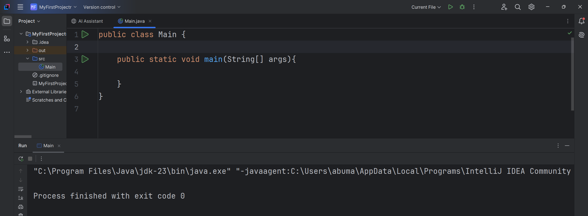
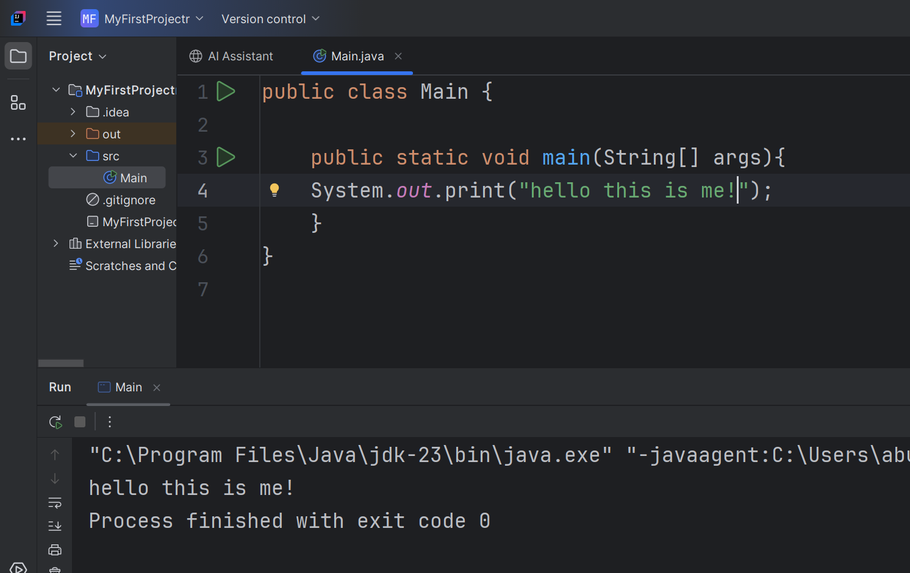
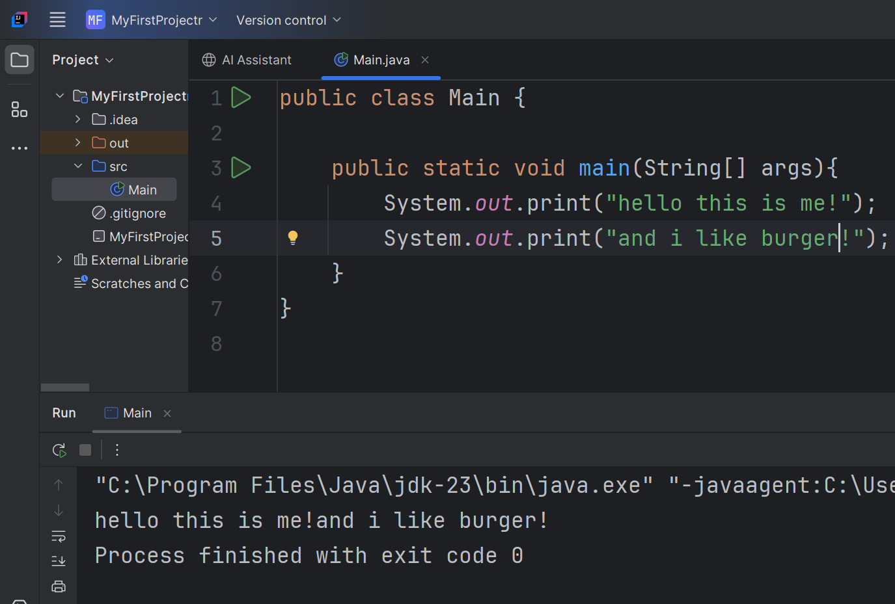
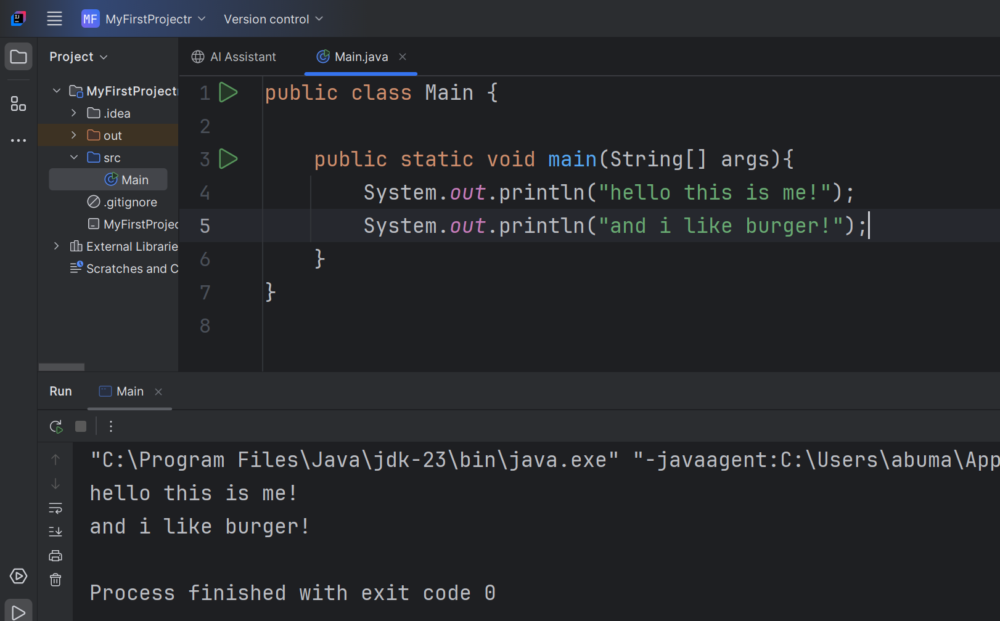
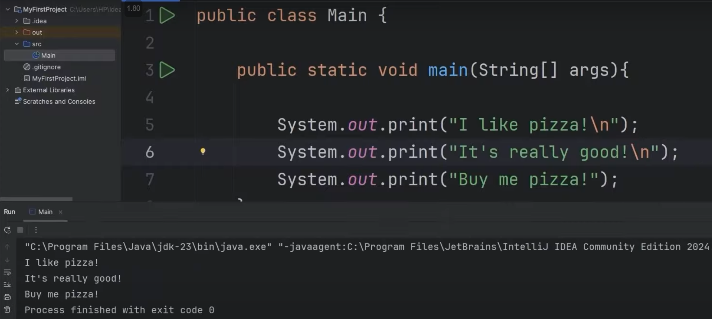
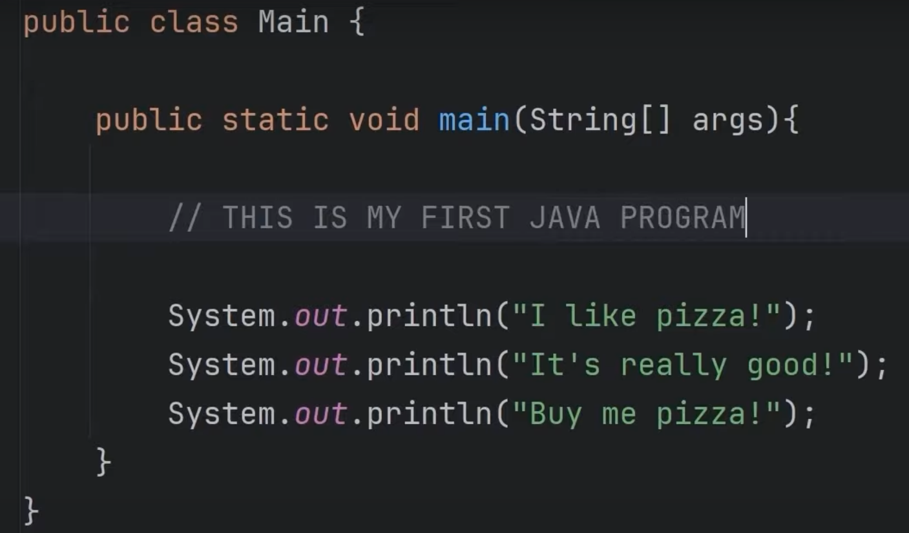

# Java Learning Journey - Day 1

## About the Journey

I am learning Java as part of my preparation for object-oriented programming (OOP) concepts in college exams. For this, I’m following **Bro Code’s Java tutorials** and using **IntelliJ IDEA** as the IDE. I’m managing my progress by creating and updating this README file day by day, pushing changes directly through VS Code.

### Resources

1. **Bro Code Lecture** (Day 1 Reference): [YouTube Link](https://youtu.be/xTtL8E4LzTQ?feature=shared)
2. **Bro Code OOP Playlist** (by a random YouTuber): [YouTube Playlist](https://youtube.com/playlist?list=PLxuuH5GnCIlcGnesYMkGQOqokyI2Fwu3g&feature=shared)

This README will cover both lab exercises and theoretical concepts, with references from Bro Code and additional internet resources.

---

## Day 1 Progress

### Key Concepts Covered

1. **The Magic Spell/Method**  
   Remember this method every time:  
   

2. **Hello World Program**  
   The first step in every programming journey:  
   

3. **Print vs Println**  
   Understanding the difference between `print` and `println` methods:  
     
   

4. **Using `\n` for New Lines**  
   You can use `\n` for inserting a new line in your output:  
   

5. **Using Comments**  
   Adding single-line and multi-line comments for better code readability:  
   Single-line comments:  
     
   Multi-line comments:  

   ```java
   /*
      This is a multi-line comment
   */
   ```

6. **Shortcut in IntelliJ IDEA**  
   Use the shortcut `sout + TAB` to quickly generate a `System.out.println` line in IntelliJ IDEA.

---

Stay tuned for more updates as I progress day by day!
