# Java Learning Journey - Day 1

## About the Journey

I am learning Java as part of my preparation for object-oriented programming (OOP) concepts in college exams. For this, I’m following **Bro Code’s Java tutorials** and using **IntelliJ IDEA** as the IDE. I’m managing my progress by creating and updating this README file day by day, pushing changes directly through VS Code.

### Resources

1. **Bro Code Lecture** (Day 1 Reference): [YouTube Link](https://youtu.be/xTtL8E4LzTQ?feature=shared)
2. **Bro Code OOP Playlist** (by a random YouTuber): [YouTube Playlist](https://youtube.com/playlist?list=PLxuuH5GnCIlcGnesYMkGQOqokyI2Fwu3g&feature=shared)

This README will cover both lab exercises and theoretical concepts, with references from Bro Code and additional internet resources.

---

## Day 1 Progress

### Key Concepts Covered

#### 1. **The Magic Spell/Method**

In Java, every program begins with a "magic spell," which is the method structure. This is the foundation for executing any code. Always remember this structure when writing programs:


---

#### 2. **Hello World Program**

The first step in learning any programming language is writing a "Hello World" program. It demonstrates the basic syntax and setup for running Java code. Here's the example:


---

#### 3. **Print vs Println**

It’s essential to understand the difference between `print` and `println`:

- **`print`**: Outputs text on the same line.
- **`println`**: Outputs text and moves the cursor to the next line.

Examples:

  


---

#### 4. **Using `\n` for New Lines**

You can use the escape sequence `\n` to insert a new line in the output without needing multiple `println` statements:


---

#### 5. **Using Comments**

Comments are essential for explaining code and improving readability. Java supports:

- **Single-line comments** using `//`:
  
- **Multi-line comments** using `/* ... */`:

```java
/*
   This is a multi-line comment
*/
```

---

#### 6. **Shortcut in IntelliJ IDEA**

A helpful shortcut in IntelliJ IDEA is `sout + TAB`, which automatically generates a `System.out.println` line. This saves time during coding.

---

### Variables

#### What are Variables?

Variables are containers for storing data. In Java, variables can be categorized into:

1. **Primitive Variables**: Store simple data types like integers, doubles, or characters.
2. **Reference Variables**: Store references to objects (e.g., Strings).

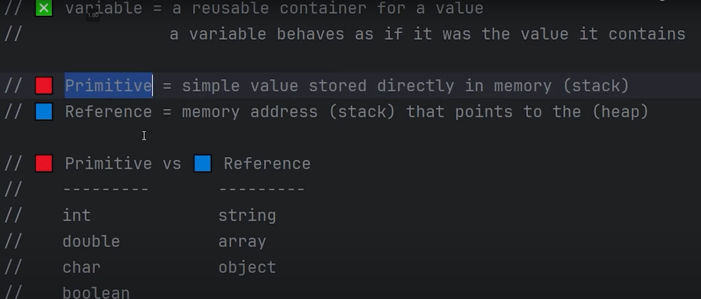

#### Creating a Variable

To create a variable, you need two steps:

1. **Declaration**: Specify the type and name of the variable.
2. **Assignment**: Assign a value to the variable.

Example:


Note: If you declare an `int` variable and assign it a non-integer value (e.g., `21.5`), it will result in a compilation error.

---

#### More Examples of Variables

**Printing Integer Variables:**

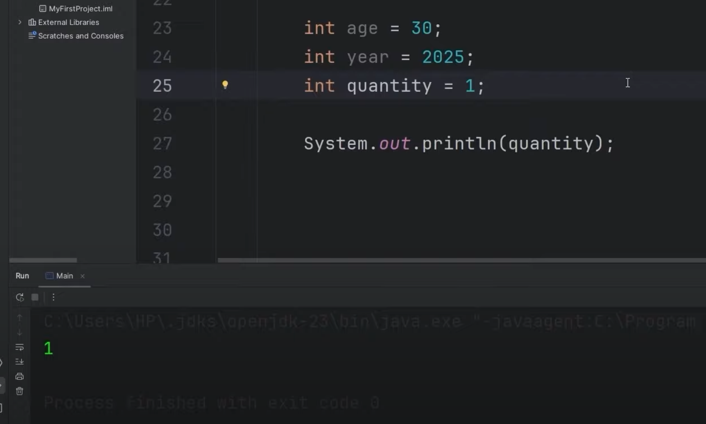  
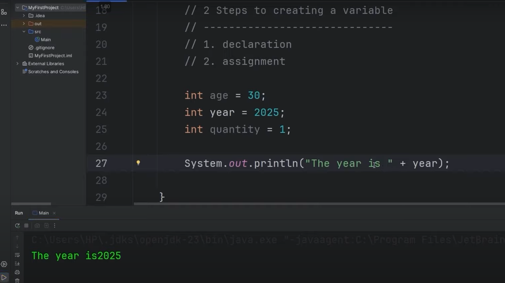  
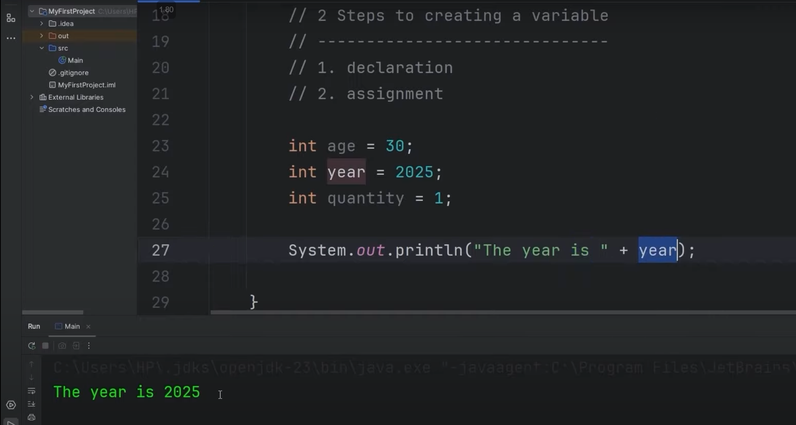  
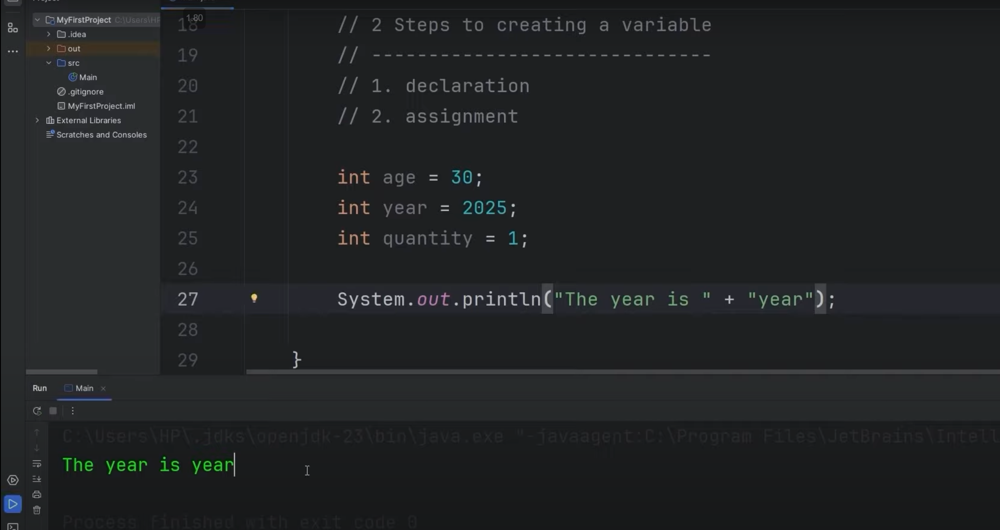

**Using Double Variables:**

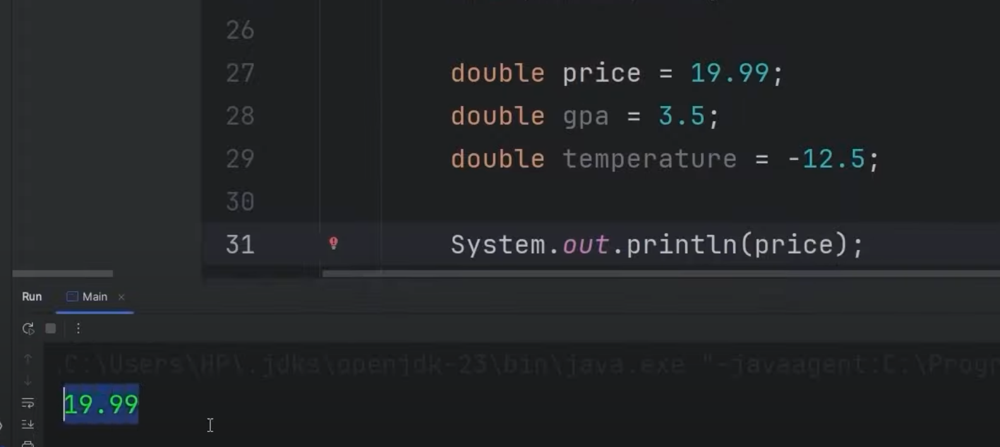  
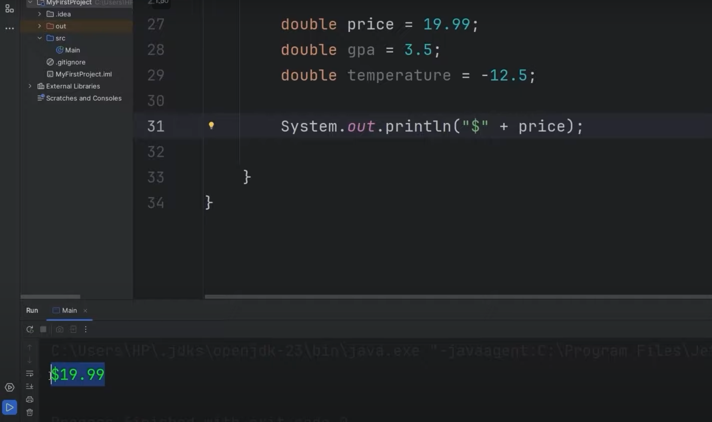  
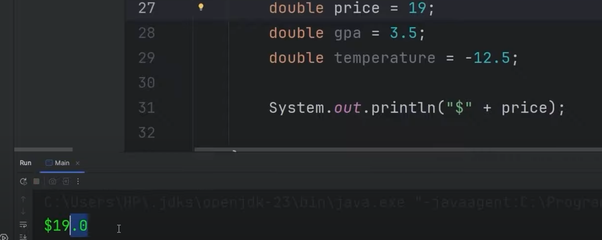

**Character Variables:**

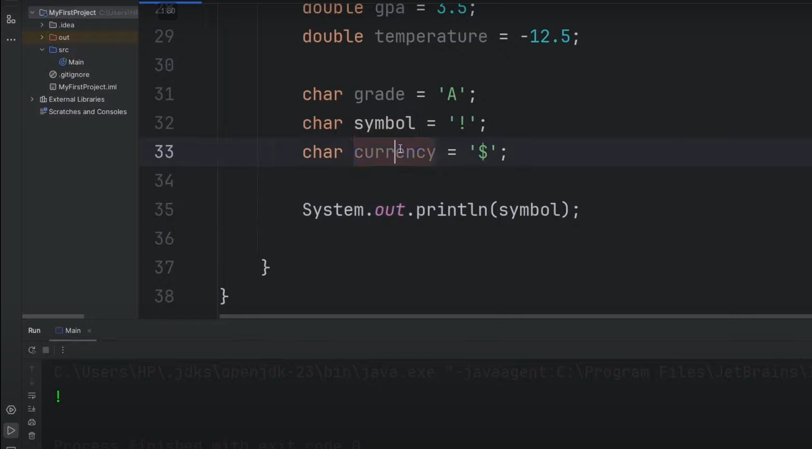

**Boolean Variables:**
Booleans store true or false values. Use them with `if` statements for decision-making in your code:


Example using boolean in an `if` statement:

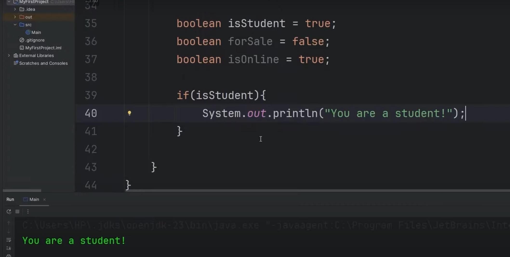

---

### Data Types in Java

Here’s a quick reference for Java’s primitive data types:

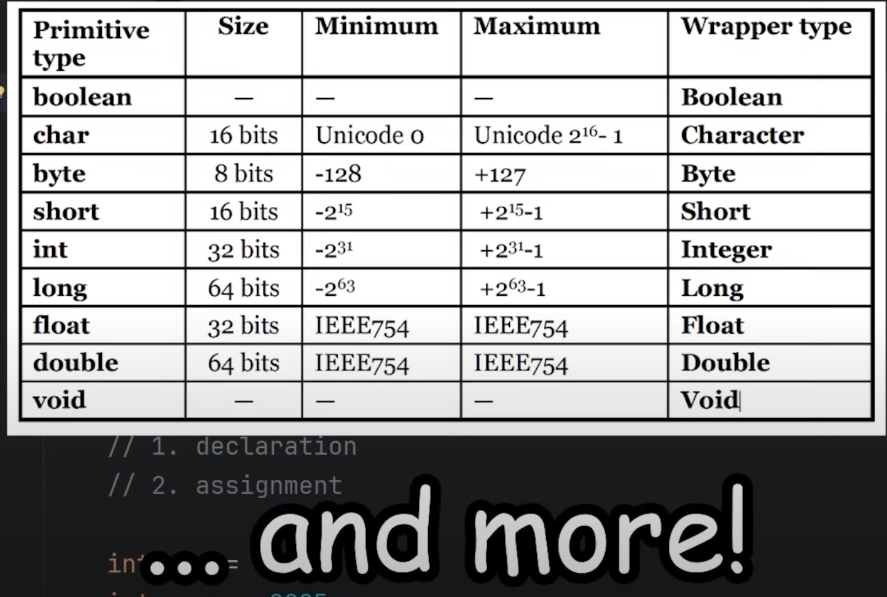

---

### Reference Data Types

#### Strings

Strings are a reference data type used to store sequences of characters. They offer a variety of methods for manipulation and processing.

Example:

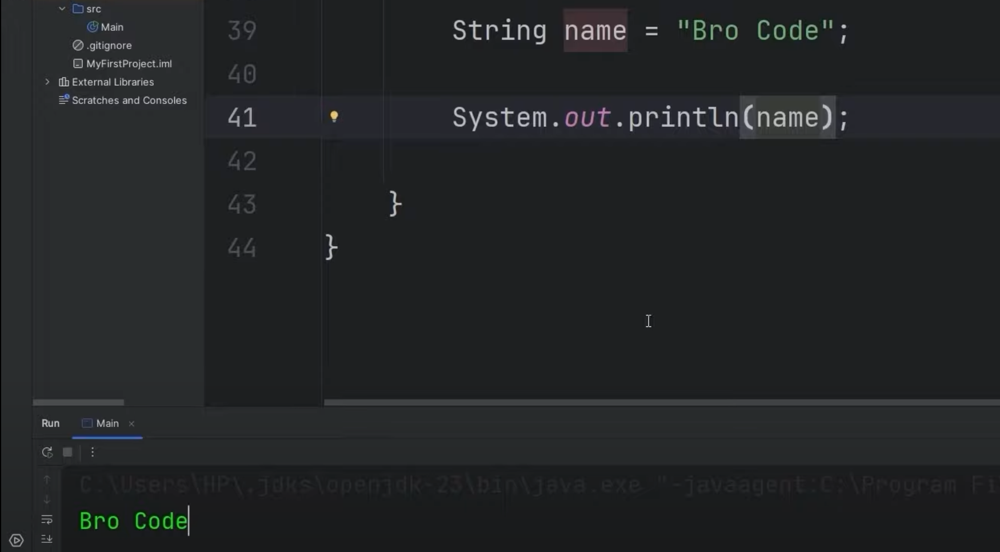

#### String Concatenation

You can combine strings using the `+` operator. This is useful for constructing meaningful output messages.

Examples:

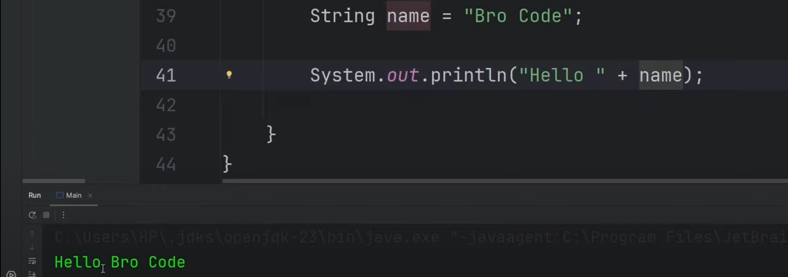  
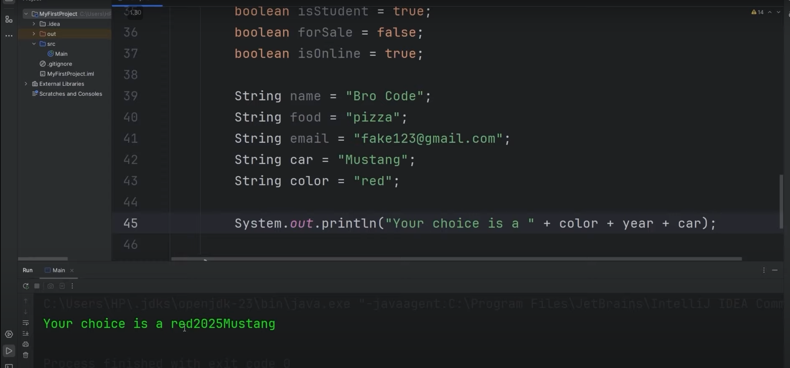  
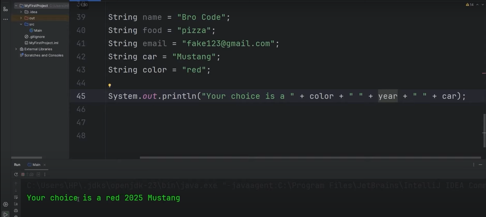

---

This concludes the notes for Day 1. Stay tuned for more updates as I dive deeper into Java programming!
